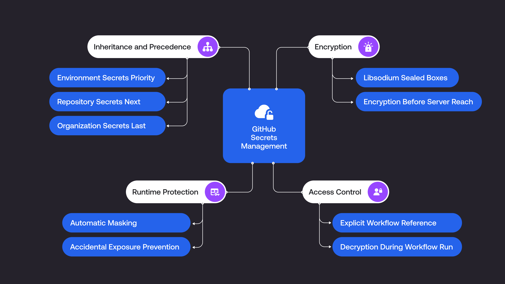
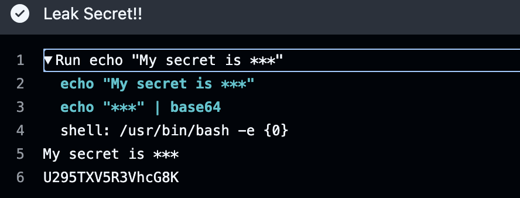

# Curiosity Report: GitHub Actions Secrets

## Introduction
We've all told a secret to someone who then has gone and shared it with everyone. It sucks. We learned to only share secrets with those we really trust, and even then they can still disappoint us. So how do we so easily trust GitHub with our secrets? How do we know that GitHub isn't sharing our secrets with its pals and laughing at us? In this report I'll dive into what makes GitHub Actions secrets reliable enough that we confidently store sensitive data there.

## What are GitHub Secrets?
GitHub Secrets are encrypted values you configure at the repository, environment, or organization level for use in GitHub Actions. You never commit the plaintext in your repo instead, workflows reference them through the `secrets` context (for example `${{ secrets.MY_API_KEY }}`). They matter for DevOps because CI/CD pipelines need credentials. API tokens, cloud keys, signing certificates and more without baking them into YAML or source control. GitHub also enforces rules for example, secrets are not passed to workflows from fork PRs which limits abuse of untrusted code.

## How and when are they Encrypted and Decrypted?

### 1. Libsodium Sealed Boxes
When you save a secret in the UI GitHub encrypts it **before** it is stored. The design uses public-key cryptography called Libsodium sealed boxes. Your secret is encrypted to a key GitHub controls, so what sits in storage is not the raw string. That is why you can only ever overwrite a secret or delete it. You cannot read the value back out through the API after it is set.

### 2. Just In Time Decryption
Decryption happens when a workflow run actually needs the secret, roughly just in time for the job. The runner receives the decrypted value only in the execution context not as a permanent file in your repo. The plaintext exists only for that run, in memory on the runner, which is a smaller exposure window than storing secrets in the repository forever.

### 3. Log Redaction
After decryption, GitHub still tries to keep secrets out of logs. The masking engine scans log output and replaces known secret values with `*****`. Which is not the same as encryption. It is a safety net so accidental echo of a token does not publish it in build logs. As the experiment below shows, masking is pattern-based on the exact string. If you transform the secret the masker may not recognize it, which is why the real guarantee is encryption at rest and tight handling at runtime. Not log masking alone.

I found this Diagram to be really helpful, I did not make it. Credit is in the sources at the end.



## Experiment
To understand how GitHub protects secrets during execution, I tried to "leak" one on purpose in a test repository.

**The Setup**

Create a secret in your repo called `MY_TEST_SECRET` with the value `SoyMuyGuapo`.

Create a workflow file that tries to print it:

```yaml
steps:
  - name: Leak Secret!!
    run: |
      echo "My secret is ${{ secrets.MY_TEST_SECRET }}"
      echo "${{ secrets.MY_TEST_SECRET }}" | base64
```

**The Result**



The first echo shows: `My secret is ***`. GitHub's masker caught it!

The second echo shows a Base64 string `U295TXV5R3VhcG8K`

**Conclusion of the experiment:** GitHub masks the exact string. If you transform the secret like we did with Base64 the masker can't "see" it anymore. This proves that masking is a UI safety feature but the real security is the encryption that happened at the start and the controlled way the runner receives the value.

## Conclusion
GitHub Actions are amazing and diving into how secrets work makes me trust the platform even more. Not blind trust but confidence backed by how the pieces fit together. It becomes clear that security isn't a single feature, but a coordinated strategy. Encryption at rest, scoped access, just in time delivery to runners, and log masking each address a different part of the problem. Seeing what happens behind the scenes makes the "magic" of GitHub Actions even more impressive.

### Sources
- https://docs.github.com/en/actions/security-guides/using-secrets-in-github-actions#about-secrets
- https://libsodium.gitbook.io/doc/public-key_cryptography/sealed_boxes
- https://www.blacksmith.sh/blog/best-practices-for-managing-secrets-in-github-actions
