# Penetration Testing Report - JWT Pizza

## Both peers names

- Peer 1: Adriano
- Peer 2: Leo

## Self attack - Adriano

#### Attack 1

| Item | Result |
| --- | --- |
| Date | April 13, 2026 |
| Target | pizza-service.adrianodemartin.com (PUT /api/auth) |
| Classification | Identification and Authentication Failures |
| Severity | 2 |
| Description | Tried to brute force passwords. Got in. |
| Images | 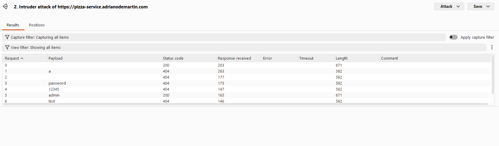 |
| Corrections | Add account lockout or exponential backoff, and rate-limit login endpoint. |

#### Attack 2

| Item | Result |
| --- | --- |
| Date | April 13, 2026 |
| Target | pizza-service.adrianodemartin.com (POST /api/order)|
| Classification | Broken Access Control |
| Severity | 0 |
| Description | Changed order and user IDs in Burp Repeater to test cross-user access. Unsuccessful. |
| Images | 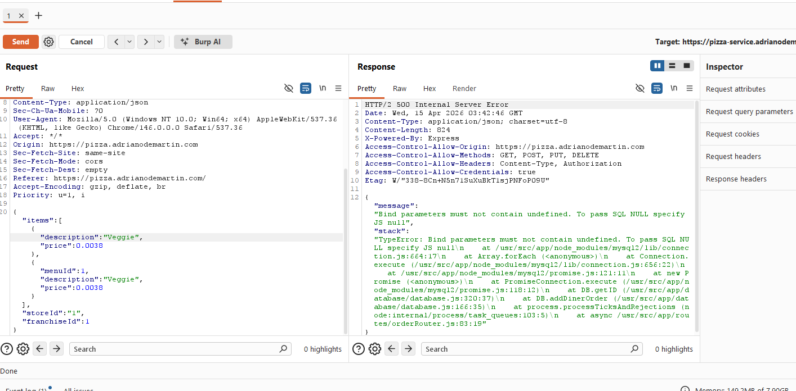 |
| Corrections | Enforce server-side ownership checks on all object access and mutations. |

#### Attack 3

| Item | Result |
| --- | --- |
| Date | April 13, 2026 |
| Target | pizza-service.adrianodemartin.com (GET /api/user/me) |
| Classification | Software and Data Integrity Failures |
| Severity | 0 |
| Description | Edited JWT token data and replayed protected requests. Unsuccessful. |
| Images | 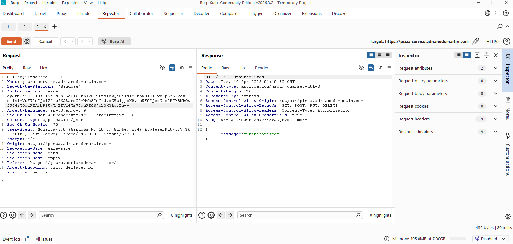 |
| Corrections | Enforce strict signature, exp, iss, and aud validation for all bearer tokens. |

#### Attack 4

| Item | Result |
| --- | --- |
| Date | April 13, 2026 |
| Target | pizza-service.adrianodemartin.com (PUT /api/user/20) |
| Classification | Injection |
| Severity | 3 |
| Description | Sent SQL-style input payloads to test unsafe input handling. High risk behavior observed. |
| Images | 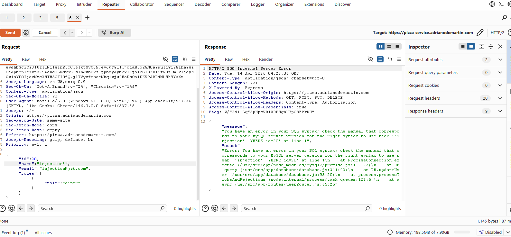 |
| Corrections | Validate and sanitize input; apply output encoding and safe query construction. |

#### Attack 5

| Item | Result |
| --- | --- |
| Date | April 13, 2026 |
| Target | pizza-service.adrianodemartin.com (GET /api/order/menu) |
| Classification | Security Misconfiguration |
| Severity | 1 |
| Description | Tested CORS and security headers using custom Origin values and response header checks. |
| Images | 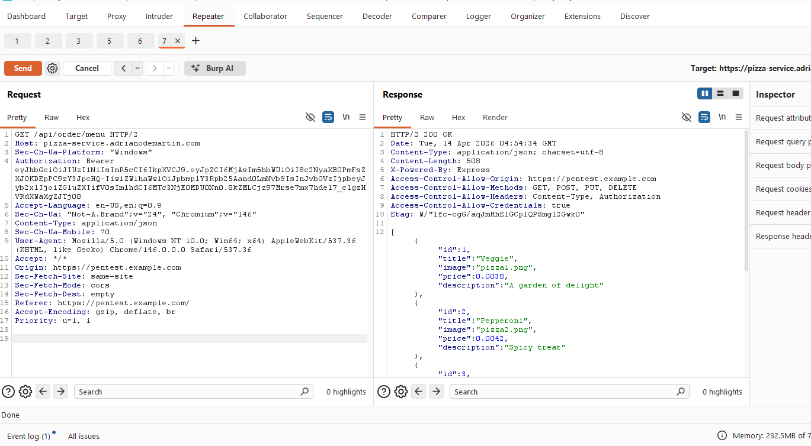 |
| Corrections | Restrict allowed origins and allow only known frontend origins. |

### Self attack - Leo

#### Attack 1

| Item | Result |
| --- | --- |
| Date | April 13, 2026 |
| Target | pizza-service.cs329pizzawebsite.click (PUT /api/auth) |
| Classification | Identification and Authentication Failures |
| Severity | 1 |
| Description | Burp Intruder was used to automate password guesses against login. Many guesses were processed without observed lockout, and failed responses exposed verbose error details including stack traces. |
| Images | 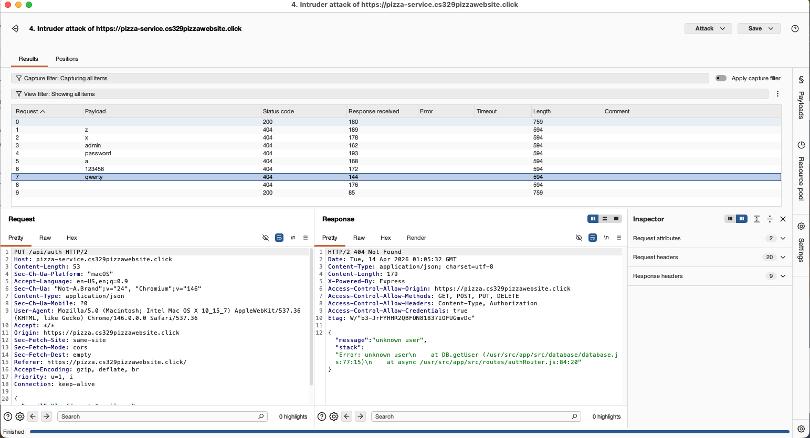 |
| Corrections | Add login rate limiting or temporary lockout and return generic auth failures without stack traces. |

#### Attack 2

| Item | Result |
| --- | --- |
| Date | April 14, 2026 |
| Target | pizza-service.cs329pizzawebsite.click (GET /api/franchise/:id) |
| Classification | Broken Access Control |
| Severity | 2 |
| Description | ID tampering was tested by changing franchise IDs while authenticated as a diner. Some IDs returned empty results while /api/franchise/1 returned franchise and store data, requiring authorization review. |
| Images | 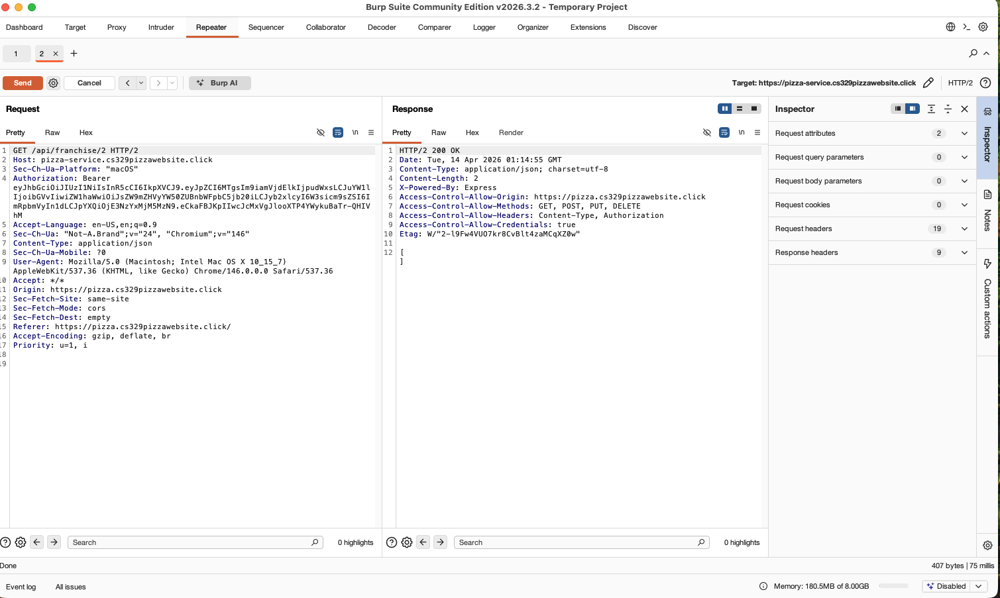 |
| Corrections | Enforce role-based authorization on franchise reads and return explicit 403 when access is not allowed. |

#### Attack 3

| Item | Result |
| --- | --- |
| Date | April 14, 2026 |
| Target | pizza-service.cs329pizzawebsite.click (POST /api/order) |
| Classification | Insecure Design / Software and Data Integrity Failures |
| Severity | 3 |
| Description | Replayed order creation with modified payloads. Client-supplied items[].price was accepted and reflected in created orders, and invalid menuId produced 500 responses with stack traces. |
| Images | 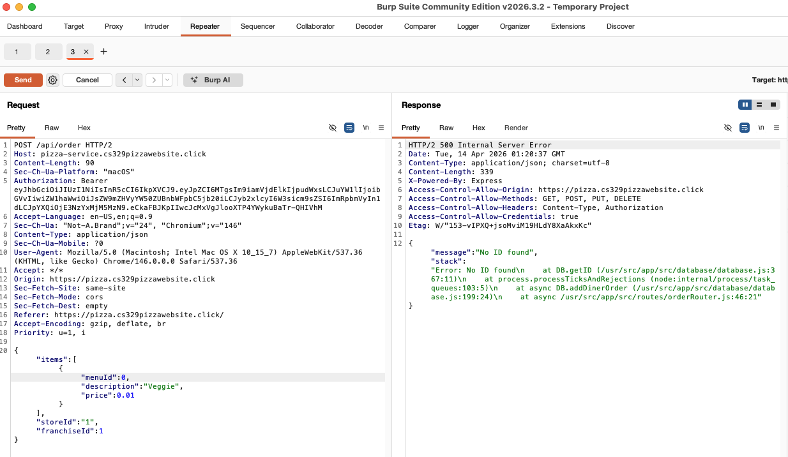 |
| Corrections | Recompute price server-side from menu data, validate franchise/store/menu IDs, and return safe 4xx errors without stack traces. |

#### Attack 4

| Item | Result |
| --- | --- |
| Date | April 14, 2026 |
| Target | pizza-service.cs329pizzawebsite.click (GET /api/franchise?page=...&limit=...&name=...) |
| Classification | Injection (probe) / Security Misconfiguration |
| Severity | 1 |
| Description | Query parameter fuzzing (name=*, encoded wildcard, long values) did not prove SQL injection, but showed broad wildcard matching and highlighted the need for strict search and input controls. |
| Images | 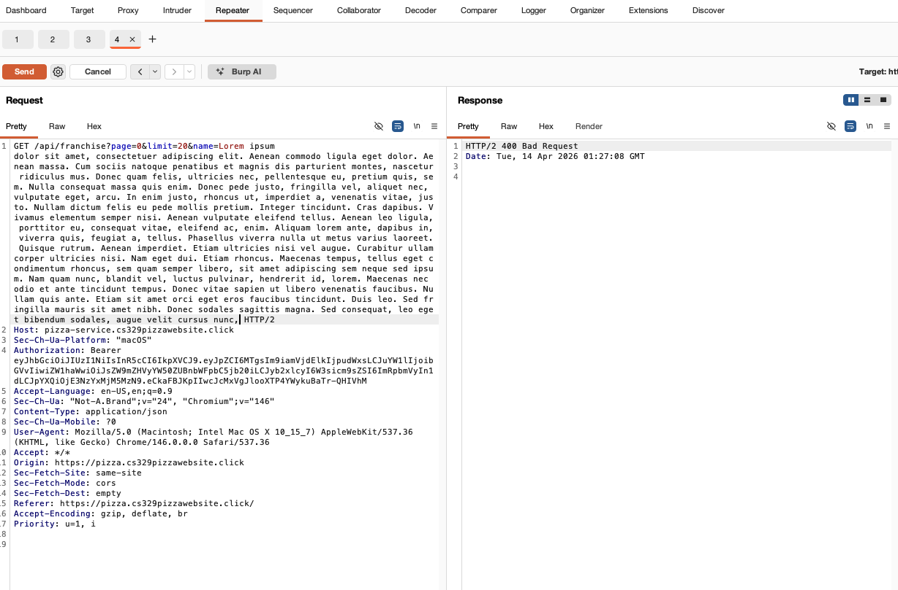 |
| Corrections | Keep input length limits, maintain parameterized query handling, and preserve non-verbose failure responses. |

#### Attack 5

| Item | Result |
| --- | --- |
| Date | April 14, 2026 |
| Target | pizza-service.cs329pizzawebsite.click (GET /api/user/me) |
| Classification | Identification and Authentication Failures |
| Severity | 0 |
| Description | JWT structure was inspected and malformed bearer tokens were replayed. Invalid token requests were correctly rejected with 401 unauthorized and no user data leak. |
| Images | 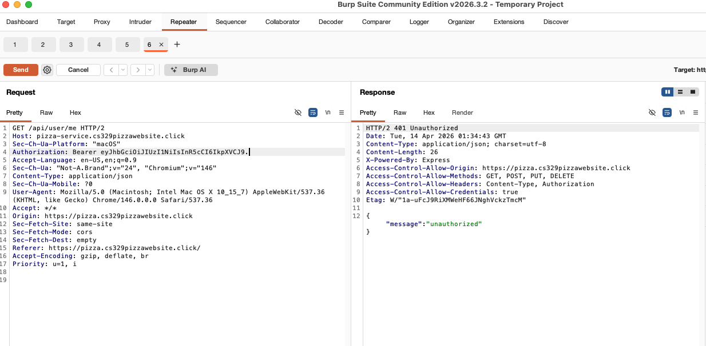 |
| Corrections | No change required for token rejection; continue strict token validation and generic unauthorized responses. |

## Peer attack

### Adriano attack on Leo

#### Attack 1

| Item | Result |
| --- | --- |
| Date | April 14, 2026 |
| Target | pizza-service.cs329pizzawebsite.click (PUT /api/user/:id) |
| Classification | Broken Access Control |
| Severity | 0 |
| Description | Attempted privilege escalation by setting roles to admin in PUT /api/user/:id. Server returned user and token with diner role only. Unsuccessful. |
| Images | 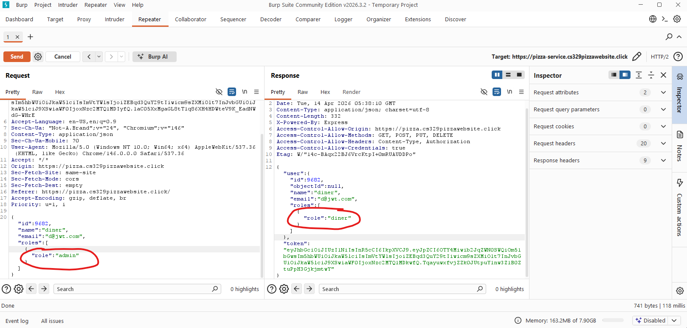 |
| Corrections | Keep server-side role assignment only and ignore client-supplied role fields. |

#### Attack 2

| Item | Result |
| --- | --- |
| Date | April 14, 2026 |
| Target | pizza-service.cs329pizzawebsite.click (PUT /api/auth) |
| Classification | Identification and Authentication Failures |
| Severity | 1 |
| Description | Tested login handling with invalid credentials on PUT /api/auth. Endpoint returned 404 unknown user plus stack trace details, exposing internal error behavior and aiding account-enumeration attempts. |
| Images | 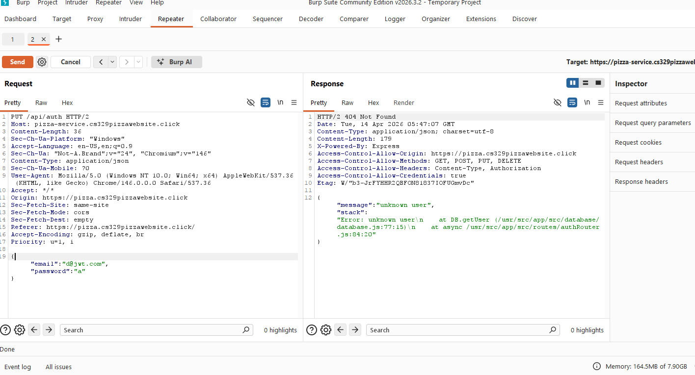 |
| Corrections | Return generic auth errors for all login failures and remove stack traces from production responses. |

#### Attack 3

| Item | Result |
| --- | --- |
| Date | April 14, 2026 |
| Target | pizza-service.cs329pizzawebsite.click (PUT /api/user/:id) |
| Classification | Insecure Design |
| Severity | 0 |
| Description | Tested mass-assignment by adding extra body field (guapo) and role fields in PUT /api/user/:id. Server ignored unauthorized fields and preserved expected role values. Unsuccessful. |
| Images | 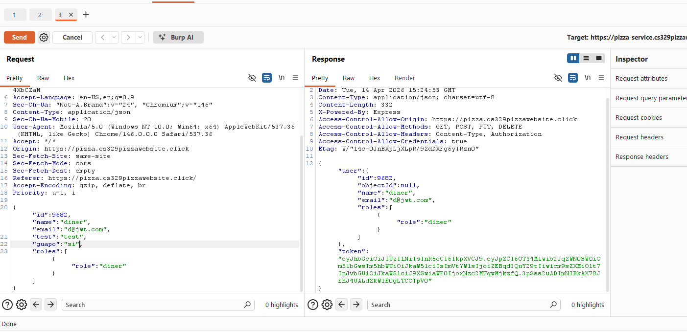 |
| Corrections | Continue allow-listing accepted update fields and ignore all non-supported body properties. |

#### Attack 4

| Item | Result |
| --- | --- |
| Date | April 14, 2026 |
| Target | pizza-service.cs329pizzawebsite.click (PUT /api/user/:id) |
| Classification | Injection |
| Severity | 2 |
| Description | Sent SQL-style payload in PUT /api/user/:id (name: "x', email='owned@jwt.com"). Response returned 404 unknown user with stack trace, indicating query behavior was altered by crafted input. |
| Images | 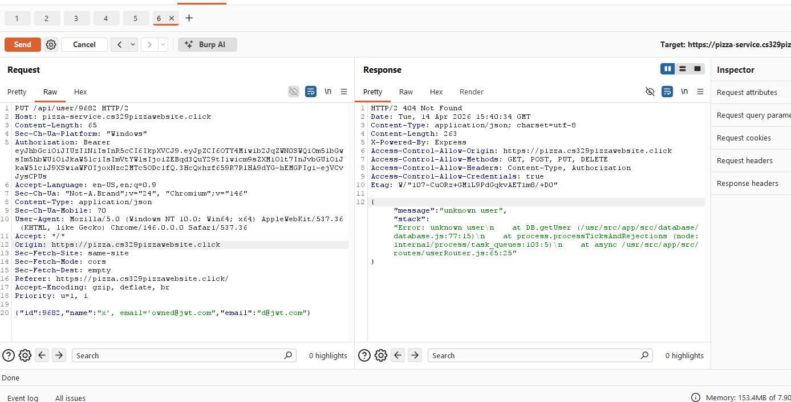 |
| Corrections | Use parameterized queries for all user fields (name, email) and remove stack traces from production error responses. |

#### Attack 5

| Item | Result |
| --- | --- |
| Date | April 14, 2026 |
| Target | pizza-service.cs329pizzawebsite.click (GET /api/franchise?page=999&limit=10&name=*) |
| Classification | Security Misconfiguration |
| Severity | 0 |
| Description | Tested extreme pagination/filter input on GET /api/franchise?page=999&limit=10&name=*. Endpoint handled request safely and returned an empty result set without errors. Unsuccessful. |
| Images | 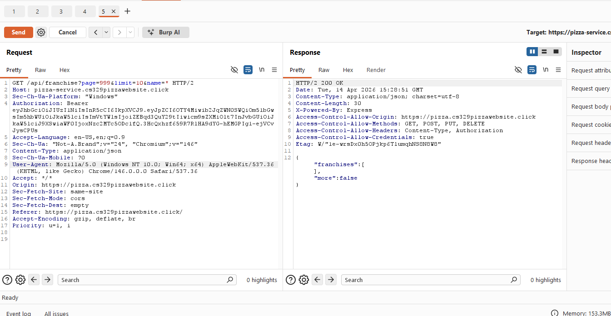 |
| Corrections | Keep current pagination bounds and input handling; continue validating query parameters server-side. |

### Leo attack on Adriano

#### Attack 1

| Item | Result |
| --- | --- |
| Date | April 14, 2026 |
| Target | pizza-service.adrianodemartin.com (POST /api/order) |
| Classification | Insecure Design / Security Misconfiguration |
| Severity | 2 |
| Description | Repeater tampering on order payload fields produced repeatable 500 Failed to fulfil order at factory responses, indicating weak handling of malformed client order data and operational error leakage. |
| Images | 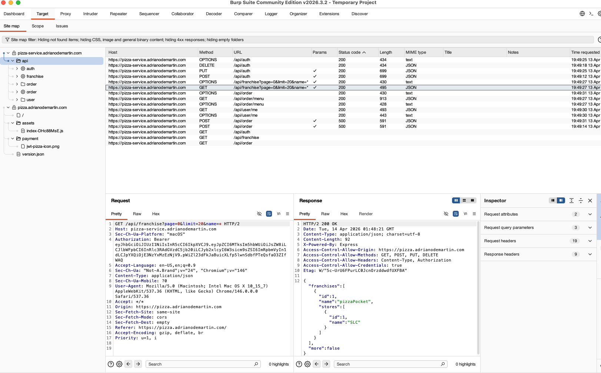 |
| Corrections | Validate order payloads before factory forwarding, return client-safe 4xx errors for invalid input, and avoid exposing internal operational references. |

#### Attack 2

| Item | Result |
| --- | --- |
| Date | April 14, 2026 |
| Target | pizza-service.adrianodemartin.com (GET /api/franchise, GET /api/franchise/:id) |
| Classification | Broken Access Control |
| Severity | 1 |
| Description | Authorization probing showed mixed outcomes between list and ID endpoints during testing, suggesting authorization behavior should be reviewed for consistency and least-privilege exposure. |
| Images | 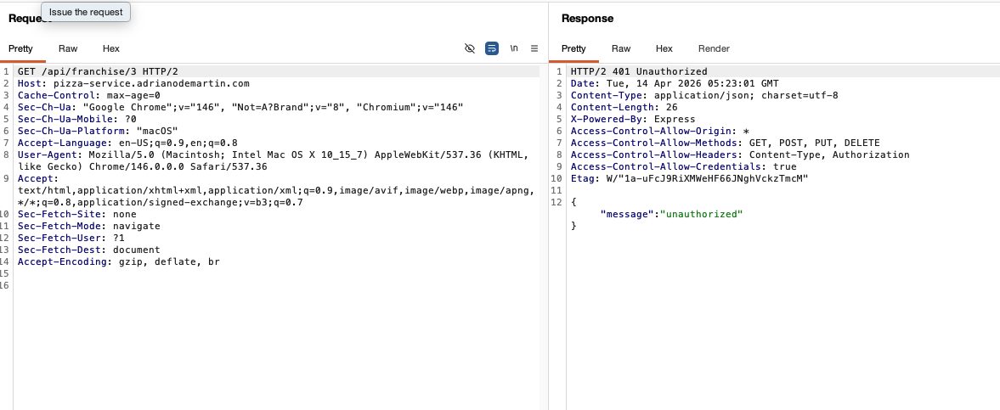 |
| Corrections | Apply consistent role checks across list and detail franchise endpoints and minimize data returned to non-privileged users. |

#### Attack 3

| Item | Result |
| --- | --- |
| Date | April 14, 2026 |
| Target | pizza-service.adrianodemartin.com (PUT /api/auth) |
| Classification | Identification and Authentication Failures |
| Severity | 1 |
| Description | Intruder-based password guessing attempts were executed and failed responses included verbose details, increasing attacker reconnaissance value. |
| Images | 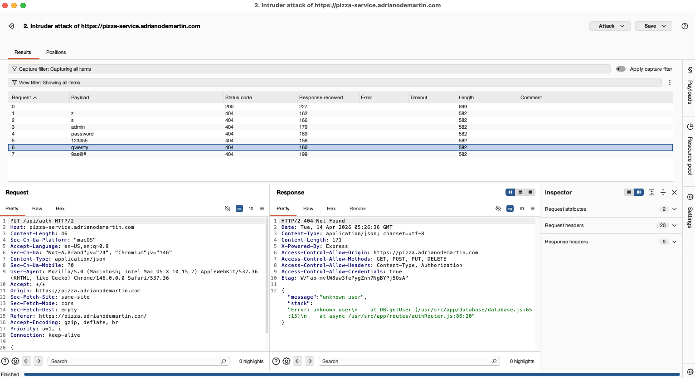 |
| Corrections | Add login throttling/lockout controls and remove stack/file-path details from auth failure responses. |

#### Attack 4

| Item | Result |
| --- | --- |
| Date | April 14, 2026 |
| Target | pizza-service.adrianodemartin.com (GET /api/franchise?...&name=...) |
| Classification | Injection (probe) / Security Misconfiguration |
| Severity | 1 |
| Description | Query fuzzing with wildcard and quoted values did not crash the service but showed broad-match behavior, indicating the need for strict search semantics and safe defaults. |
| Images | 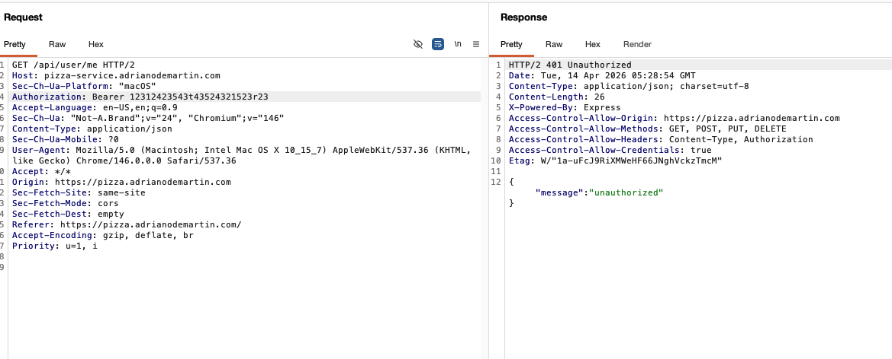 |
| Corrections | Enforce tighter search input constraints and keep parameterized query handling with stable error responses. |

#### Attack 5

| Item | Result |
| --- | --- |
| Date | April 14, 2026 |
| Target | pizza-service.adrianodemartin.com (GET /api/user/me) |
| Classification | Identification and Authentication Failures |
| Severity | 0 |
| Description | Invalid bearer token replay was rejected with 401 unauthorized, and protected user data was not disclosed. |
| Images | 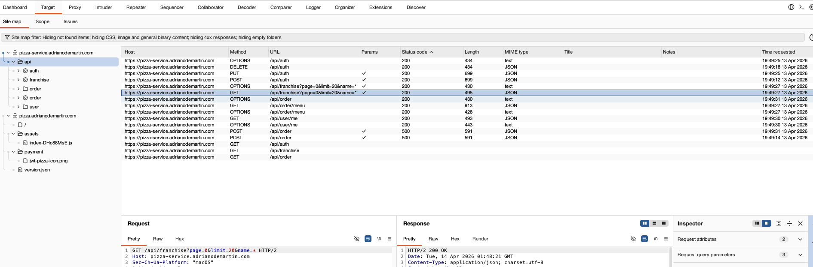 |
| Corrections | No change required for this behavior; continue strict token validation and generic unauthorized responses. |

## Combined summary of learnings

This project showed us that small API mistakes can quickly become real security issues, especially around authentication, role/permission checks, and input handling. We learned that some attacks fail because protections are working like blocked role escalation and rejected JWT tampering and those are still important results to document. We also found that weak error handling can leak stack traces and help attackers understand backend behavior and that SQL style payloads can still affect query logic if inputs are not safely parameterized. Burp was most effective when used in order Proxy to discover requests, Repeater for controlled manual tests, and Intruder for repeated attempts. The biggest takeaway is to always enforce security on the server side, keep responses generic, validate all input, and use safe query patterns by default.

